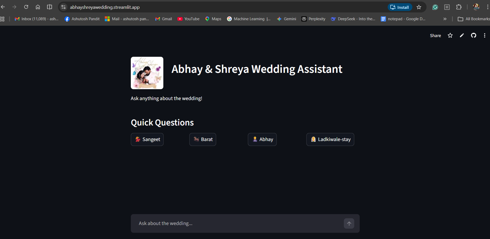
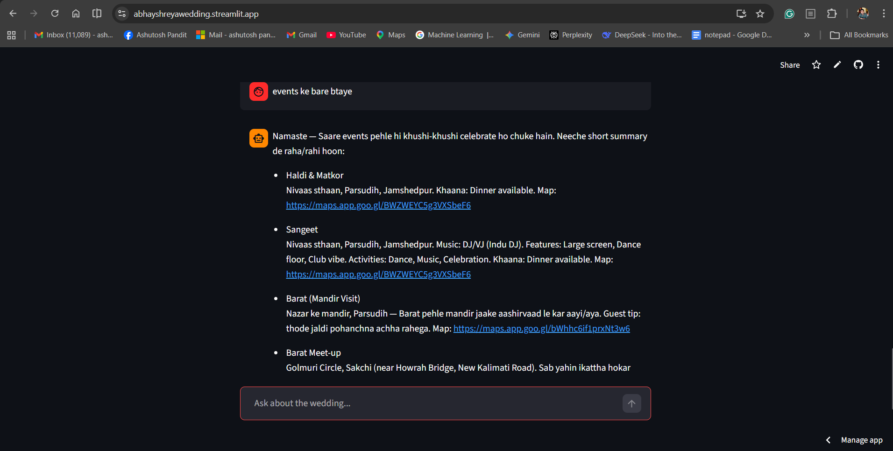
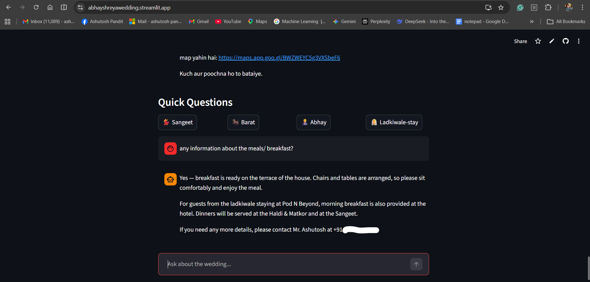

#🤖 AI Wedding Event Assistant

An AI-powered conversational assistant designed to help wedding guests quickly access event schedules, venue information, and meal updates during a multi-day wedding celebration.

Guests can simply ask questions in natural language and receive real-time responses.

📸 Application Screenshot

Example screenshot:

• application home page
• event schedule response
• meal update response

##🎯 Project Motivation

During large weddings, guests frequently ask questions like:

What ceremony is happening now?

Where is the Barat meetup?

When is dinner served?

Where is the wedding venue?

Instead of repeatedly sharing information in chat groups, this assistant provides instant answers using Generative AI.

This assistant was built for my brother-in-law’s wedding and was actively used by guests from both the groom’s and bride’s sides.

##✨ Key Features
###💬 Conversational AI Assistant

Guests can ask questions naturally:

What event is happening now?
Where is the Barat meetup?
Is breakfast available?
Where is the wedding venue?
⏱ Real-Time Event Awareness

The assistant dynamically checks the current date and time to determine:

ongoing ceremonies

upcoming events

completed celebrations

###🍽 Smart Meal Announcements

The system automatically informs guests when:

breakfast

lunch

evening tea

dinner

are available.

###📍 Venue Navigation

Provides location information and map links for venues.

###🎉 Ritual Fallback Message

If no major ceremony is happening, the assistant informs guests that traditional rituals like Haldi Lepan or family celebrations are ongoing at the groom’s residence.

##🏗 AI Architecture

The project follows a tool-based AI architecture.

User Question
      ↓
AI Agent (LangGraph)
      ↓
Tool Router
      ↓
Specialized Tools

Tools used:

Tool	Purpose
Wedding Tool	Retrieves ceremony details
Meal Update Tool	Provides meal announcements
Maps Tool	Venue directions
Couple Tool	Couple information

Each tool retrieves structured data from JSON files.

The assistant then generates a natural language response.

##⚙ Tech Stack

Core technologies used in the project:

Python

Prompt Engineering

Tool-based AI architecture

JSON structured data

AI Frameworks:

LangChain

LangGraph

Deployment & Interface:

Streamlit

GitHub

##📂 Project Structure
src/
 ├── agent.py
 ├── graph.py
 ├── app.py
 └── tools/
      ├── wedding_tool.py
      ├── meal_update_tool.py
      ├── maps_tool.py
      ├── couple_tool.py
      └── ladkiwale_tool.py

data/
 ├── events.json
 └── meal_updates.json

docs/
 └── app-screenshot.png
🚀 Running the Project

Clone the repository:

git clone https://github.com/ashunikky/abhay_shreya_wedding.git
cd abhay_shreya_wedding

Install dependencies:

uv sync

##Run the application:

streamlit run src/app.py

The assistant will open in your browser.

💡 Example Interaction

User

What is happening now?

Assistant

Sangeet ceremony is currently happening at the residence.
Guests are welcome to join the celebration.

User

Is breakfast available?

Assistant

Breakfast is ready at the terrace of the house.
Chairs and tables are arranged for guests.
🌍 Real-world Usage

This assistant was created for a real wedding event and used by guests during the celebration to:

check ceremony schedules

find venue directions

receive meal announcements

The feedback from guests was very positive and many enjoyed interacting with the assistant.

##🔮 Future Improvements

Possible enhancements include:

WhatsApp chatbot integration

Voice interaction

Admin dashboard for live updates

Push notifications for upcoming events

Multi-language support

###👨‍💻 Author

Ashutosh Pandit

Exploring practical applications of Generative AI and intelligent assistants.

###⭐ If you found this project interesting

Consider giving the repository a star.